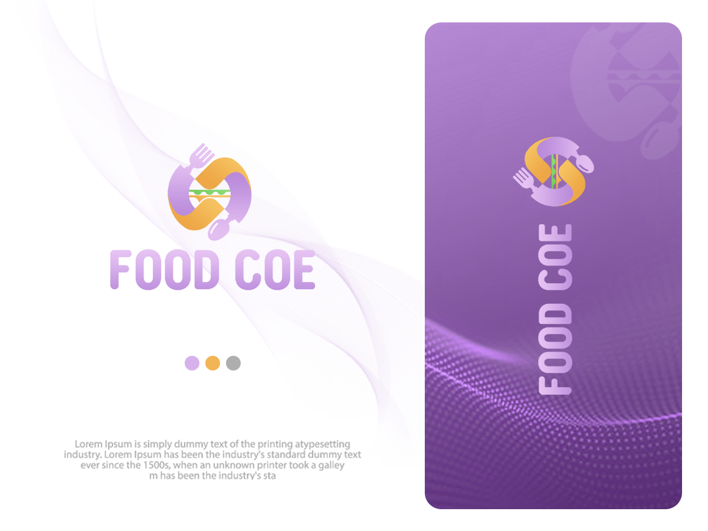

# FOOD COE

<figure><figcaption>
FOOD COE
</figcaption></figure>

_**FOOD COE is the first traditional business to merge with the world of digital currencies. For the first time in Iran and even the Middle East, FOOD COE was able to use the tools of the world of digital currencies to integrate a traditional business with the world of digital currencies and create a different experience for customers.**_

Cold Sandwich, **FOOD COE** is the first traditional **business** that integrates with the cryptocurrency structure on the **ICP blockchain** and offers financial rewards to its customers. FOOD COE uses the tools of the cryptocurrency world to bring a new experience to its sandwich customers.

Eat sandwiches, become a member of the customer club and earn money from the entire sale of this sandwich shop.

### Creative use of blockchain tools

Creative use of blockchain tools as leverage to increase sales. No matter how much you know about the cryptocurrency world, you can learn how to create an **ICPswap wallet** in no time and see FOOD COE **NFTs** in your **wallet** after joining the customer club. You can earn from the amount of income of this sandwich shop by keeping these NFTs on a monthly basis.

The concept and applications of NFTs are not yet clear to the general public. It is very important to understand that the tools of the cryptocurrency world can have general applications.\
With the help of the **FOOD COE** brand, the general public can easily have a new experience in buying from the traditional market. An experience that is only possible with the help of NFT and the cryptocurrency world.

The food industry as a potential human need can always be considered, especially if we offer creativity in cooking and provide a new experience to customers.

#### Cultivation

With the help of **ICP blockchain** tools and the **web3** platform, we are no longer worried about the geographical location of people and attitudes. In the new world, we have a wallet that is our identity, we can load the name and official data from the real identity of the development teams for the wallet.

**Security, privacy, complete transparency on the ICP platform.** Blockchain's mission is to be able to decentralize and create lines for international financial interactions in a decentralized manner. FOOD COE's financial reports are provided as open source and in the form of reports with ICP currency.\
Do you use the **COE plan** for business development? What is your currency? It doesn't matter, as a COE incorporated business you file your **financial** reports in the ICP unit format.

#### Community-oriented economy

The COE project on the **ICP** Blockchain is integrating traditional businesses with its token structure with the aim of growing community-driven economic flow. The COE development team has been researching and studying for over 1.5 years. COE believes that any traditional business can connect its income structure to the **COE token** and use the marketing plan of this project to grow its sales if it complies with the established frameworks!

In the real world, the community will buy food from the FOOD COE brand and earn money in the form of COE cryptocurrency. COE team with the support of BABYAROF project proposed the idea of opening FOOD COE in the first step with the aim of real research in the market.

In this cooperation event, the BABYAROF team spent an amount equal to 185 ICPs for the setup. This amount of ICP token was traded with a value equal to 1688 dollars. In the second step, the FOOD COE brand is presented in the form of a public plan so that interested parties from anywhere in the world can be business partners in the FOOD COE sector.

