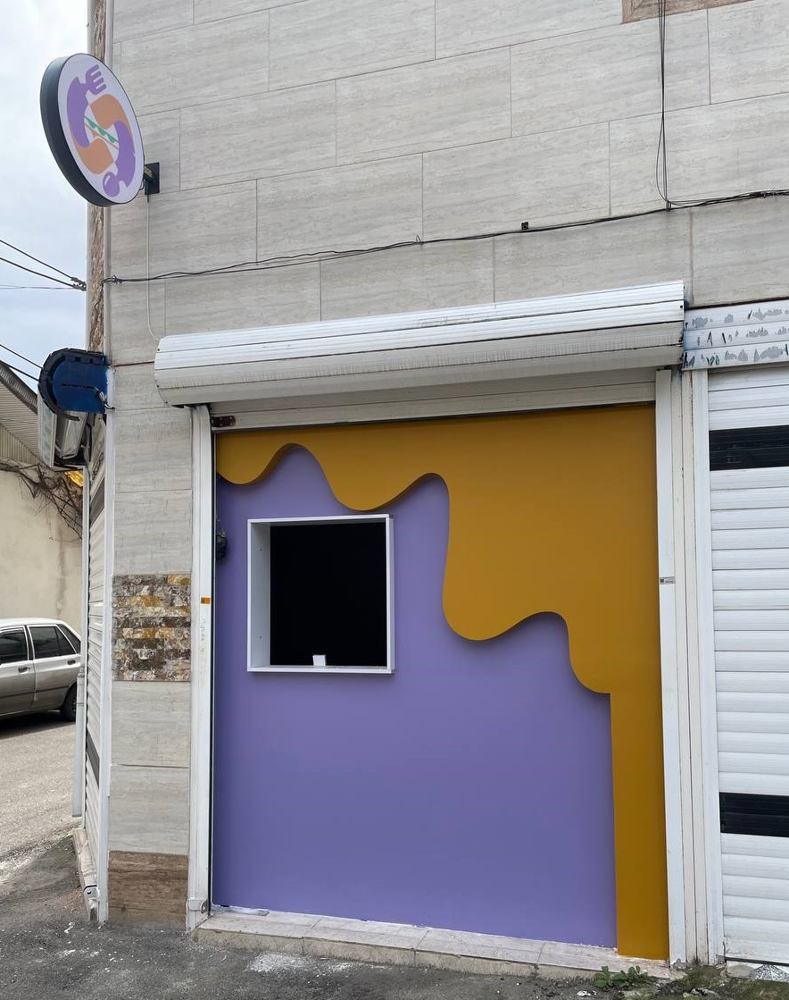

# Effects of FOOD COE

<figure><figcaption>
23/3/2024
</figcaption></figure>

**What are the effects of FOOD COE on the growth of the ICP ecosystem and the culture of creative use of decentralized tools among traditional businesses?** People who may not have been familiar with the crypto world until yesterday, but today they receive a gift in the form of NFT and they know the world of cryptocurrency with the ICP blockchain.

Directing the cash flow from the traditional market to the ICP ecosystem is an event that can be very effective in the long term.\
The development of FOOD COE as an open source and available to the community can motivate many people to create jobs in this way.

### Further decentralization of the COE token

The injection of significant funds in a planned way can cause FOMO. We can witness the growth of transactions on a monthly basis. The injection of significant funds will increase the price of the COE token, and the distribution of this purchased volume among members of the community can make these funds more decentralized.

The prospect of developing traditional businesses into the food, clothing and housing sectors can show us an exciting prospect of the value of the COE token. An idea that starts from an unpredictable point and will spread like a virus.  Surfing monthly deals can be very exciting. The joy of surfing on the financial flow that is formed by the community and managed by the community.

